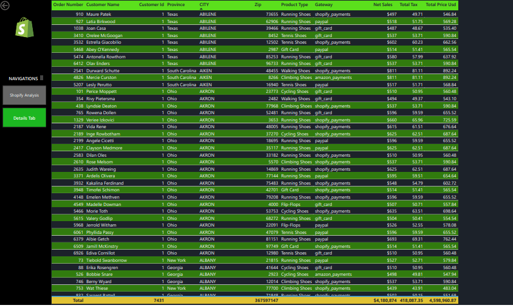
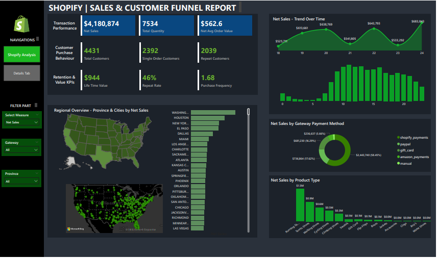

# 🛍️ Shopify Sales Analysis (Power BI)

This end-to-end Power BI project explores real-time sales data from a Shopify store to uncover actionable insights. Built as part of the *2025 Edition* of real-time Power BI case studies, it highlights data modeling, DAX calculations, and dynamic dashboards for e-commerce decision-making.

---

## 🎯 Project Objectives

- Analyze real-time sales performance across products, regions, and channels  
- Track KPIs like Revenue, Orders, Profit Margins, and Returning Customers  
- Uncover top-selling products and seasonal sales patterns  
- Build a fully interactive Power BI dashboard for executive-level reporting

---

## 🛠 Tools and Technologies

- **Power BI** – for data modeling, visualization, and interactive reporting  
- **DAX (Data Analysis Expressions)** – for KPIs and calculated columns/measures  
- **Microsoft Excel** – for preliminary data storage and processing

---

## 📂 Folder Structure

```
shopify-sales-analysis-powerbi/
│
├── data/              # Raw and cleaned Shopify sales data (.xlsx, .csv)
├── dashboards/        # Power BI .pbix file
├── screenshots/       # Dashboard preview images
└── README.md
```

---

## 🚀 Key Insights

- **Product category trends** show strong sales performance in Q4 across all regions  
- **Returning customers** drive a higher average order value than first-time buyers  
- **Sales spikes** occur during promotional campaigns and holidays  
- Dynamic dashboard reveals **profitability breakdown** by segment, enabling better inventory and marketing decisions

---

## 📊 Dashboard Preview

Screenshots from the interactive Power BI dashboard are included in the `screenshots/` folder. Use the Markdown snippet below to embed previews into documentation or GitHub:


<p align="center">
  
</p>

### 🔹 Example View:

<p align="center">
  
</p>
